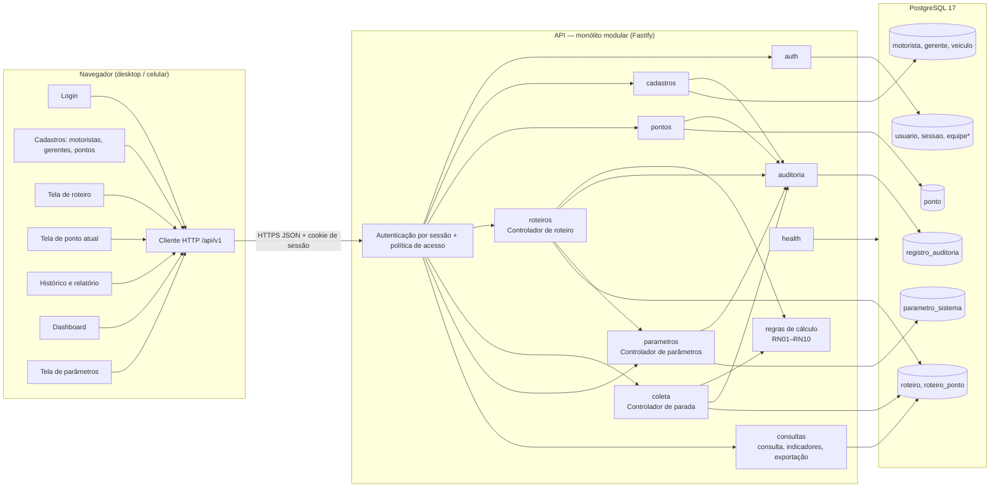

# Diagrama de componentes — RotaClara (proposta)

Editável: altere o bloco Mermaid abaixo. Boundaries do PP (p.22–27) viram páginas da SPA;
controladores viram módulos da API; entidades viram tabelas.

\* `equipe` depende da decisão D07.
