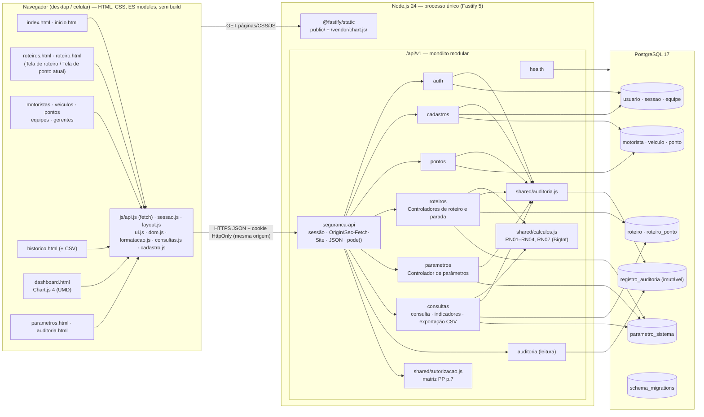

# Diagrama de componentes — RotaClara

Estado final (etapas I1–I11). Boundaries do PP (p.22–27) → páginas HTML; controladores →
módulos da API; entidades → tabelas. Editável: altere o bloco Mermaid.

