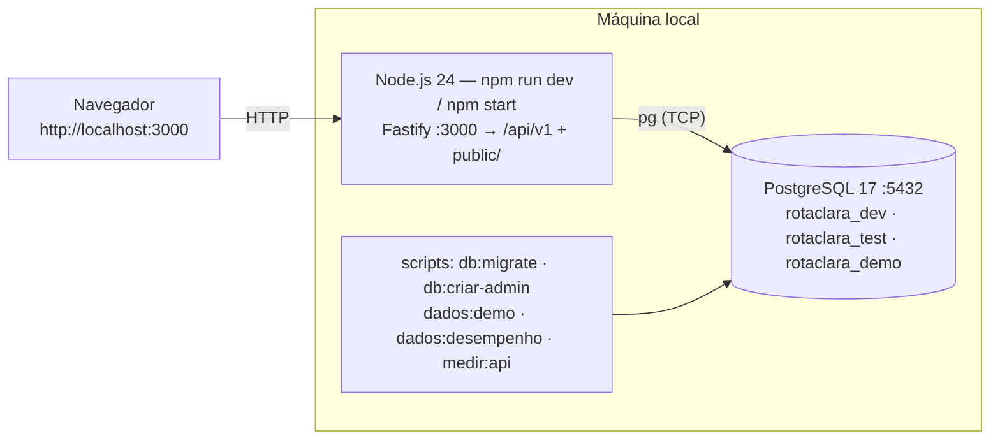
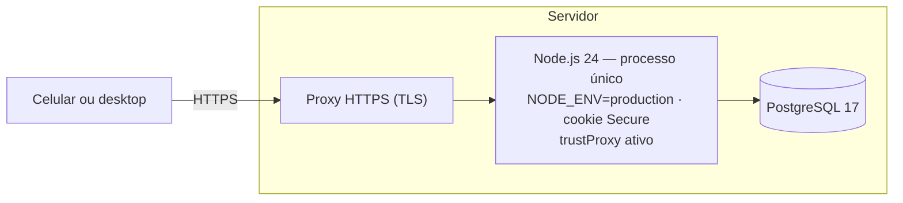

# Diagrama de implantação e execução — RotaClara

Sem etapa de build: o mesmo processo Node.js serve a API e os arquivos do frontend (mesma
origem, sem CORS). Editável: altere os blocos Mermaid.

## Desenvolvimento e demonstração (Windows 11)

## Homologação / produção (hospedagem a definir)

Sequência de implantação: `npm ci --omit=dev` → `npm run db:migrate` (aplica pendentes; nunca
apaga) → `npm run db:criar-admin` (primeira vez) → `npm start`.
