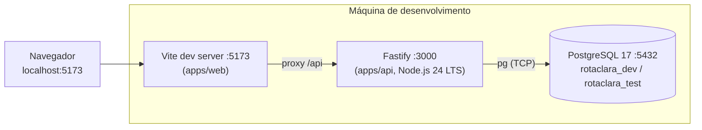
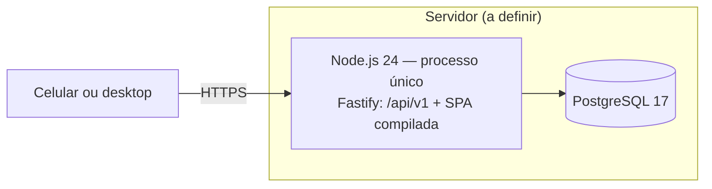

# Diagrama de implantação e execução — RotaClara (proposta)

Editável: altere os blocos Mermaid abaixo.

## Desenvolvimento (Windows 11)

## Apresentação / homologação

Fluxo de execução: `npm run db:migrate` (aplica migrações pendentes, nunca reseta) →
`npm run build` → `npm start`.
