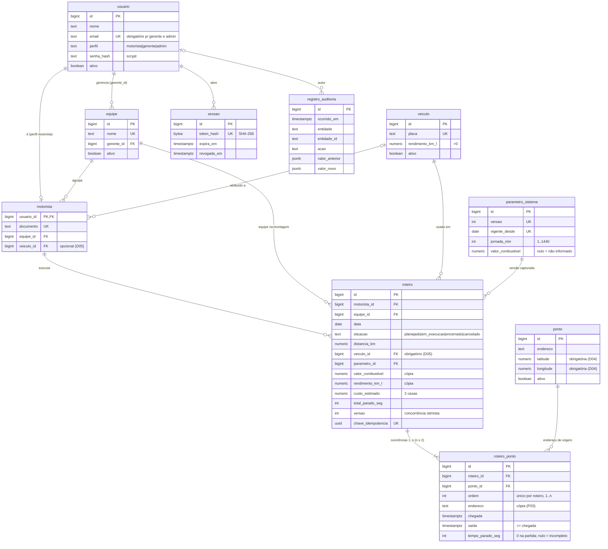

# Modelo de dados — RotaClara

Esquema final após `migrations/0001`–`0004` (PostgreSQL 17). Diagrama editável em Mermaid.

## Regras garantidas pelo banco

| Regra | Mecanismo |
|---|---|
| RN01 partida = 0 | `roteiro_ponto_partida_sem_tempo` |
| RN06 / D19 ordens 1..n, n ≥ 2 | `unique (roteiro_id, ordem)` adiável + gatilho adiado `roteiro_verificar_ordens` (verificados no commit, permitindo reordenar em várias linhas) |
| RN08 saída ≥ chegada | `roteiro_ponto_saida_apos_chegada` |
| RN07 valores positivos | `veiculo_rendimento_positivo`, `parametro_combustivel_positivo`, `roteiro_*_positivo` |
| D04, D05 | `ponto_coordenadas_obrigatorias`, `roteiro_veiculo_obrigatorio` (NOT VALID) |
| RNF05 auditoria imutável | gatilhos bloqueiam UPDATE/DELETE/TRUNCATE em `registro_auditoria` |
| D21 sem exclusão física | Nenhuma rota DELETE; chaves estrangeiras sem `on delete cascade` |

## Correspondência com o Projeto Preliminar

| Classe conceitual (PP p.28–29) | Tabela(s) | Observação |
|---|---|---|
| Usuario | `usuario`, `sessao` | Perfil em `usuario.perfil` |
| Motorista | `motorista` (+ `usuario`) | Documento único; veículo opcional (D05) |
| Gerente | `usuario` (perfil gerente) + `equipe.gerente_id` | "Equipe identificada" via `equipe` (D07) |
| Veiculo | `veiculo` | Rendimento > 0 |
| Roteiro | `roteiro` | Guarda versão de parâmetros, combustível, rendimento e custo (P04/D23) e equipe da montagem |
| RoteiroPonto | `roteiro_ponto` | Cópia do endereço/coordenadas (P03); horários e tempo |
| Ponto | `ponto` | Endereço e coordenadas obrigatórios |
| ParametroSistema | `parametro_sistema` | Versões com data de vigência |
| RegistroAuditoria | `registro_auditoria` | Imutável |
| (Equipe — D07) | `equipe` | Acrescentada para o escopo "equipe" da matriz de permissões |

| Caso de uso | Tela (boundary) | Módulo (controlador) | Tabelas |
|---|---|---|---|
| UC01 Autenticar-se | `index.html` | `auth` | usuario, sessao, registro_auditoria |
| UC02 Manter motoristas | `motoristas.html`, `veiculos.html` | `cadastros` | usuario, motorista, veiculo |
| UC03 Manter gerentes | `gerentes.html`, `equipes.html` | `cadastros` | usuario, equipe |
| UC04 Manter pontos | `pontos.html` | `pontos` | ponto |
| UC05 Montar roteiro | `roteiros.html` (Tela de roteiro) | `roteiros` (Controlador de roteiro) | roteiro, roteiro_ponto |
| UC06 Registrar chegada/saída | `roteiro.html` (Tela de ponto atual) | `roteiros` (Controlador de parada) | roteiro_ponto, roteiro |
| UC07 Calcular tempos | — (sistema) | `shared/calculos.js` | roteiro_ponto, roteiro |
| UC08 Consultar histórico | `historico.html` | `consultas` (Controlador de consulta) | roteiro, roteiro_ponto |
| UC09 Dashboard | `dashboard.html` | `consultas` (Controlador de indicadores) | roteiro, parametro_sistema |
| UC10 Parametrizar | `parametros.html` (Tela de parâmetros) | `parametros` (Controlador de parâmetros) | parametro_sistema |
| UC11 Custo estimado | `roteiro.html` | `shared/calculos.js` + `roteiros` | roteiro |
| UC12 Exportar | `historico.html` (botão) | `consultas` (Controlador de exportação) | roteiro, roteiro_ponto, registro_auditoria |
| (Auditoria, PP p.7) | `auditoria.html` | `auditoria` | registro_auditoria |

## Índices para consultas de 12 meses (RNF03)

`roteiro(data)`, `roteiro(data, situacao)`, `roteiro(motorista_id, data)`, `roteiro(equipe_id, data)`,
`roteiro_ponto(roteiro_id, ordem)` (único), `roteiro_ponto(ponto_id)`,
`registro_auditoria(entidade, entidade_id)`, `registro_auditoria(ocorrido_em)`.
